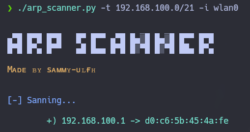

# arp_scanner

<p align="center">
    
</p>

**ARP Scanner** is a fast tool to scan active hosts and discover their Mac Address. You can use it giving the **target host** and **inerface name**.

<p align="center">
    
</p>

## What I need to run it?

1. First, you need to clone the repository:

    ```git
    git clone https://github.com/sammy-ulfh/arp_scanner.git
    ```

2. Second, you need to go to **arp_scanner/script** directory.

3. Third, you need to install the required libraries using pip:

    ```pip3
    pip3 install -r requirements.txt
    ```

## How can I use it?

- **Target:**
    First, you need to give a target using **-t / --target** argument.<br/>
    Examples:<br/>

    - **-t 192.168.0.1**
    - **-t 192.168.0.0/21**

- **Network Interface:**
    Second, you need to give a specific Network Interface Name using **-i / --interface** argument.<br/>
    Examples:

    - **-i eth0**
    - **-i ens33**
